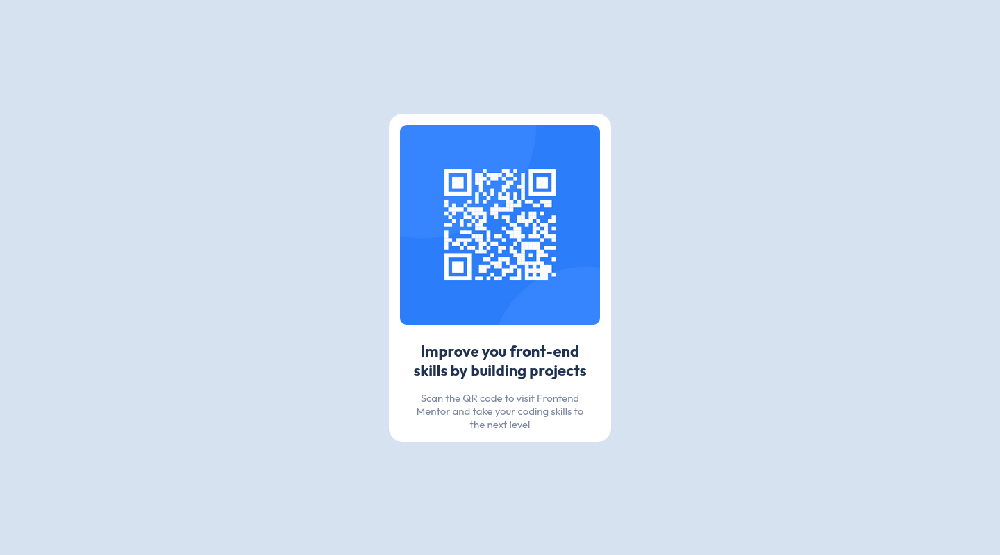

# Frontend Mentor - QR code component solution

This is a solution to the [QR code component challenge on Frontend Mentor](https://www.frontendmentor.io/challenges/qr-code-component-iux_sIO_H). Frontend Mentor challenges help you improve your coding skills by building realistic projects.

## Table of contents

- [Overview](#overview)
  - [Screenshots](#screenshot)
  - [Links](#links)
- [My process](#my-process)
  - [Continued development](#continued-development)
  - [Useful resources](#useful-resources)
- [Author](#author)
- [Acknowledgments](#acknowledgments)

## Overview

### Screenshots




### Links

- Solution URL: [Source code](https://github.com/PhantomLeii/QR-Code/)
- Live Site URL: [Live instance](https://phantomleii.github.io/QR-Code/)

### Continued development

All the front-end basics, I am alright with. HTML, to be honest, I have no real complaints about. It seems I struggle more with CSS and apprently its the same with most Devs.

I managed to work through this project comfortably but still feel I need more practice with media-queries. Yes! I centered this div effortlessly. I had a bit of a tassle working around a solution to get the page scrollable when mobile devices are in landscape orientation. In the end I managed to source an article that gave away that:

```css
@media (max-device-height: 480px) and (orientation: landscape) {
	html {
		overflow: scroll;
		scroll-behavior: smooth;
	}

	main {
		height: fit-content;
		padding: 25px 0;
	}
}
```

However, I tweaked the `(max-device-height: 480px)` from `(max-device-width: 767px)`.

### Useful resources

- [Stackoverflow article](https://stackoverflow.com/questions/40280709/apply-styles-only-in-landscape-and-only-on-mobile-devices):
  This is where I sourced my little CSS _media-query situation_

## Author

- My LinkedIn - [Lebogang Phoshoko](https://linkedin.com/in/phoshoko-ml)
- Frontend Mentor - [@PhantomLeii](https://www.frontendmentor.io/profile/PhantomLeii)
- Twitter - [@onlyphantomleii](https://www.twitter.com/onlyphantomleii)
